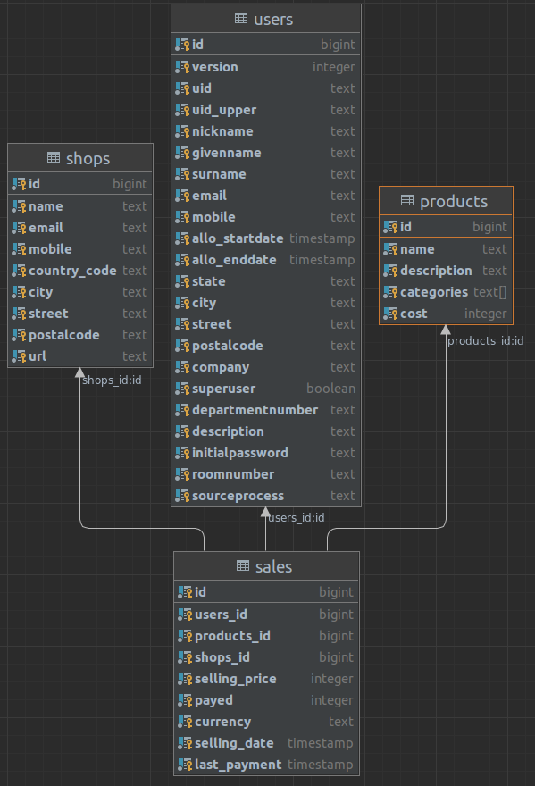

# Postgresql Query Tuning for Dummies
Repository to create a Postgres database with dummy data and query tuning samples

The repository was created to aid a tech talk. German version of the talk is at [./talk/talk_de.md](./talk/talk_de.md).
An english version will be added as soon as it's required.

The point of the query examples is to show generic examples of simple SQL rewriting to optimize performance.
The sample queries are trying to highlight special changes to improve the performance without modifying the result set.
Most of the queries can be written even faster or easier, but in real world situations this is not always possible.

Therefore, please only focus on the differences.
- Do not try to rewrite the query in this repo as fast as possible and do not try to grasp any real business logic behind the samples.
- Do not try to always just add another index to every problem. Indexes have downsides too (e.g. writing performance, dead tuple creation, hard disk consumption, ...)

## Quick start example to run and measure the samples at your client
```bash
docker rm -f tuningfordummies; 
docker run --name tuningfordummies --privileged -v /proc:/writable_docker_proc --shm-size=256mb -p 64271:5432 -v $(pwd)/scripts:/docker-entrypoint-initdb.d/ -e POSTGRESQL_PASSWORD=pg -e PGPASSWORD=pg bitnami/postgresql:11.15.0
./run_sql_samples.sh
```

## Setup database:
With the next statements you'll create a running postgres instance on port 64271 in particular version.
The db will include 4 tables in schema 'public':

| table name | rows      |
|------------|-----------|
| sales      | 2.000.000 |
| users      | 1.000.000 |
| products   | 100.000   |
| shops      | 10.000    |

The schema looks like this: 



IMPORTANT: depending on your hardware this might run a couple of minutes.
The database is available after you see this line on stdout:
`... database system is ready to accept connections`

Note: the additional env parameter PGPASSWORD=pg only allows to execute `psql -U postgres` in the running container without being prompted for the password.

Note: The arguments (`--privileged -v /proc:/writable_docker_proc`) allow dropping the OS cache within the container. We need this only for these examples to get more consistent results.
We will drop the caches with:
`docker exec -u 0 tuningfordummies bash -c 'echo 1 > /proc/sys/vm/drop_caches;'`

Note: The argument `--shm-size=256mb` extending the shared memory size to 256mb, because docker restricts the shared memory size to 64mb. 
64mb is simply not enough for some of the queries.

### Version 14.2.0 (the newest available in feb 2022):
```bash
docker rm -f tuningfordummies; docker run --name tuningfordummies --privileged -v /proc:/writable_docker_proc --shm-size=256mb -p 64271:5432 -v $(pwd)/scripts:/docker-entrypoint-initdb.d/ -e POSTGRESQL_PASSWORD=pg -e PGPASSWORD=pg bitnami/postgresql:14.2.0

```

### Version 11.15.0
```bash
docker rm -f tuningfordummies; docker run --name tuningfordummies --privileged -v /proc:/writable_docker_proc --shm-size=256mb -p 64271:5432 -v $(pwd)/scripts:/docker-entrypoint-initdb.d/ -e POSTGRESQL_PASSWORD=pg -e PGPASSWORD=pg bitnami/postgresql:11.15.0
```

## Configure amount of test data:
You can change the amount of test data in this [script](scripts/gen_data.sql.lqs).
Simply configure the amount variables in the declare section:
```
sales_amount    integer := 2000000;
users_amount    integer := 1000000;
products_amount integer := 100000;
shops_amount    integer := 10000;
```

## Connection settings for your SQL user interface
Username: postgres
Password: pg
JDBC URL: jdbc:postgresql://localhost:64271/postgres

## Execute samples and put them into a .md file:
```bash
./run_sql_samples.sh
```
[results.md](results.md)


## Result set correctness
If your not sure a fast and slow query are doing the same thing: 
 - Simply compare the results for queries with a small result set
 - Simply use count for large result sets
 - You should have business logic tests in your application. If there are none: make the world, step by step, a tiny bit better and write them!
