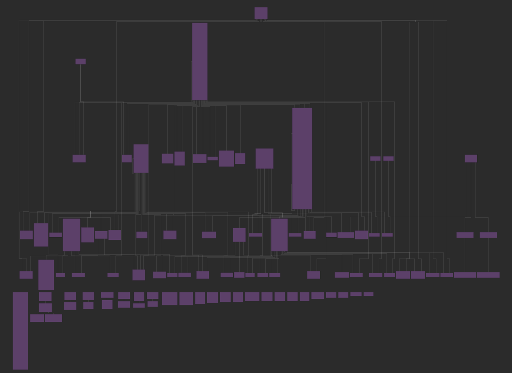

# Postgres tuning for dummies
_english version will be added at talk_en.md as soons as it's needed_

## Disclaimer
Ich bin Entwickler und KEIN Datenbankexperte. Hier soll kein gefährliches Halbwissen verbreiten werden!
Daher werden in diesem Talk diese Punkte nicht besprochen:
- Postgresql Tuning Configuration Parameters
- Query Plan Analyzing
- Hardware Sizing Recommendations

## Regeln
1) Fragen dürfen gern jederzeit gestellt werden, bei zu erwartender größerer Beantwortungsdauer werden sie aus Zeitgründen jedoch ggf. ans Ende gestellt.
2) Es dürfen nur Fragen gestellt werden, die ich beantworten kann... ;)


## Prolog
Am 14.01.2021 sind wir mithilfe von *** und *** von DB2 auf Postgres migriert.
Wir haben seither fast ausschließlich positive Erfahrungen mit der Datenbank gemacht.
Nur um ein Gefühl für die Datenbank zu bekommen, so sieht unser Schema aus:


Die Berechtigungen der Nutzer unseres Produkts werden mit dynamisch generierten und recht komplexen _where clauses_ beschränkt.
Hierzu setzen wir massiv die Criteria API von Hibernate ein.

Nach der Umstellung liefen viele der Abfragen performanter als mit DB2, manche jedoch auch langsamer und andere gleich langsam/schnell.
Seit der Umstellung haben wir daher einige Queries in Java anpassen müssen, damit sie entsprechend schnell dieselben Ergebnisse zurückliefern.

In diesem Tech-Talk werden daher unsere Erfahrungen und unser pragmatisches Vorgehen geteilt.

## Non-Scientific Try-Fail-Repeat Ansatz
Liebe Datenbankexperten: ab hier solltet ihr ganz tief durchatmen, einen Tee holen, die Lieblings Kuscheldecke schnappen oder nötigenfalls schreiend wegrennen:
Wir haben so gut wie nie auf `explain analyse` zurückgegriffen und stattdessen durch Try-And-Error, Teile einer langsamen Query auskommentiert, bis wir die vermeintlich langsamen Stellen identifiziert hatten.
Das Query-Explain ist großartig und liefert viele nützliche Informationen, aber für uns war das Ausprobieren effizienter, da:
- Wir das Schema, die Tabellen und deren Größen, die Keys und Indexe bereits sehr gut kennen
- Wir nicht wissen müssen, wieso sich die Datenbank für Query Plan A oder B entscheidet
- Wir lediglich eine schnellere alternative finden müssen
- Wir an Hibernate gebunden sind und sich nicht jede SQL-Optimierung zurückübersetzen lässt 

Spoiler: Wir konnten mit unserem Vorgehen und kleinen Anpassungen, bislang jede Abfrage auf eine hinreichend annehmbare Ausführungszeit optimieren. 
Teilweise von > 30 Minuten auf < 1 Sekunde.

## Dieses Repo
Setup und Schema dieses Repos: [README.de](../README.md)

## Vorgehen im Detail
1) Die Plain SQL-Query holen
2) Performance Killer finden
3) Performance durch alternative Abfrage verbessern
4) Richtigkeit der Ergebnismenge sicherstellen
5) Abfrageanpassungen in Code / HQL / das ORM Framework übersetzen

### Die Plain SQL-Query holen
Es gibt verschiedene Möglichkeiten, um an die Abfragen zu kommen. Für Hibernate unter anderem über den `net.sf.log4jdbc.DriverSpy`.
Die schnellste und stabilste Lösung für uns ist es jedoch, das Logging temporär auf der Datenbank zu aktivieren.
Auch hier gibt es unterschiedliche Möglichkeiten, die sich schnell ergooggeln lassen. 
Wir editieren meist die Konfiguration (`log_statement = all`, `log_min_duration_statement = 0`) und führen ein `pg_ctl reload` aus.
Siehe [./trace_on.sh](./trace_on.sh) / [./trace_off.sh](./trace_off.sh)

In diesem Beispielsetup werden die Logs und Statements auf der Kommandozeile geprinted.
Mit etwas Shell+Python Magie lassen sich die, meist Prepared Statements, mit ihren Parametern jedoch deutlich angenehmer ausgeben. 
Siehe [./trace_show.sh](./trace_show.sh).

### Live Demo: Performance Killer finden && Performance durch alternative Abfrage verbessern
Werte Datenbankexperten, jetzt müsst ihr wieder ganz tapfer sein, wir werden versuchen diese Query zu beschleunigen: 
[./stupid_long_and_complex_query.sql](./stupid_long_and_complex_query.sql)

Dazu werden wir sie Stück für Stück gemeinsam durchgehen, den Grund der Langsamkeit finden und ihn optimieren:
[./stupid_long_and_complex_query_solution.sql](./stupid_long_and_complex_query_solution.sql)


### Richtigkeit der Ergebnismenge sicherstellen
Das die schnellere Abfrage noch dieselben fachlich geforderten Ergebnisse zurückliefern muss ist selbstverständlich.
Für uns reichte es daher meist aus:
1. Für kleine Ergebnismengen, die Ergebnismenge geordnet zu vergleichen
2. Für größere Ergebnismengen die Anzahl der Ergebnisse zu vergleichen
3. Automatisierte Tests, Tests, Tests! Sollte es keine geben, so macht die Welt Stück um Stück ein kleines bisschen besser und schreibt welche.

### Abfrageanpassungen in Code / HQL / das ORM Framework übersetzen
Da dies für jedes Projekt extrem unterschiedlich ist, werden hierauf nicht näher eingehen. 
Es sei an dieser Stelle nur gewarnt: Nicht jede SQL Optimierung lässt sich ohne gigantischen Aufwand in den ORM übersetzen.
Hibernate unterstützt beispielsweise keine AND/OR Operation an Joins:
`select * from foo join faa on foo.id = faa.foo_id AND foo.xxx = 'yyy'`

## Weitere Beispiele
Ähnlich dem Austausch von `in` zu `exists` haben wir im Laufe der Zeit einige weitere alternative Abfragemöglichkeiten gefunden,
die sich mit etwas Übung einfach erkennen lassen und die Performance enorm verbessern können.
Die Abfragen lassen sich alle gesammelt mit diesem Skript ausführen:
```bash
../run_sql_samples.sh
```
Die [Ergebnisse](../results.md) lassen sich so relativ schnell mit unterschiedlichen Konfigurationsparametern und Datenbank vergleichen:

| GOOD                                                                                                  | BAD                                                                                                 |
|-------------------------------------------------------------------------------------------------------|-----------------------------------------------------------------------------------------------------|
| [5_GOOD_upper-vs-ilike.sql](../sql_samples/5_GOOD_upper-vs-ilike.sql)                                 | [5_BAD_upper-vs-ilike.sql](../sql_samples/5_BAD_upper-vs-ilike.sql)                                 |
| [1_GOOD_distinct-vs-distinct_on.sql](../sql_samples/1_GOOD_distinct-vs-distinct_on.sql)               | [1_BAD_distinct-vs-distinct_on.sql](../sql_samples/1_BAD_distinct-vs-distinct_on.sql)               |
| [2_GOOD_in-vs-exists.sql](../sql_samples/2_GOOD_in-vs-exists.sql )                                    | [2_BAD_in-vs-exists.sql](../sql_samples/2_BAD_in-vs-exists.sql)                                     |
| [3_GOOD_subquery-missing-backlink-id.sql](../sql_samples/3_GOOD_subquery-missing-backlink-id.sql)     | [3_BAD_subquery-missing-backlink-id.sql](../sql_samples/3_BAD_subquery-missing-backlink-id.sql)     |
| [4_GOOD_subquery-unnecessary-backlinks.sql](../sql_samples/4_GOOD_subquery-unnecessary-backlinks.sql) | [4_BAD_subquery-unnecessary-backlinks.sql](../sql_samples/4_BAD_subquery-unnecessary-backlinks.sql) |

Sollte noch Zeit übrig sein und es so weit keine Fragen geben, gibt es noch 2 weitere Beispiele, 
die ich jedoch mit dieser Sample DB einfach nicht reproduzieren konnte:
- [subquery-kill-unnecessary-joins.sql](../sql_samples_not_reproducible/subquery-kill-unnecessary-joins.sql)
- [evil-or.sql](../sql_samples_not_reproducible/evil-or.sql)

## Akronyme
| Akronym |                                   |
|---------|-----------------------------------|
| API     | Application Programming Interface |
| HQL     | Hibernate Query Language          |
| ORM     | Object-Relational Mapping         |
| SQL     | Structured Query Language         |
